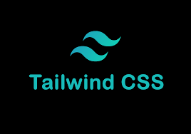
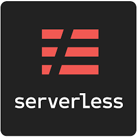
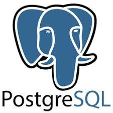

# Hi there! 👋

Welcome to my profile! I'm [Jhensen Aquino](https://github.com/jhensena).

### About Me:

- 👨‍💻 Sr. full-stack developer with over 9 years of experience.
- 😊 Good communicator
- 💡 Passionate about providing a good solution
- ⏲️💪 Always build the best products within a given timeline and with minimum effort

### Techincal stacks and tools I use:

  
  
  
  
   
  
  
  
  
  
   
  
  
   
  
  
  
  
   
  
  
   
  
  
  
   
  
  
  
  
  
   
  
  
  

